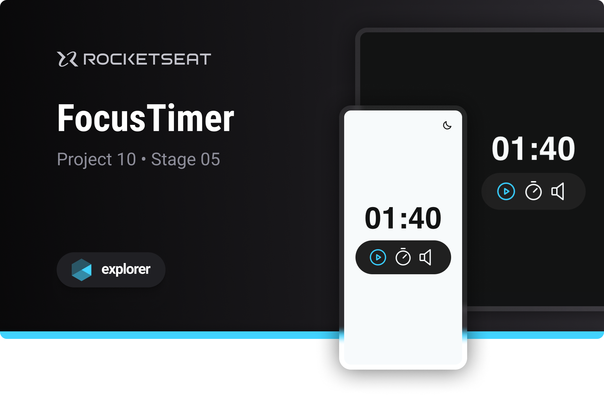

# FocusTimer

Project developed on Rocketseat's Explorer course

**FocusTimer is a pomodoro style timer designed to learn basic JavaScript programming concepts**

## 🔗 Project Links

- 🚀 [**Deploy**](https://emanueltavecia.github.io/focustimer)
- 🎨 [**Figma**](https://www.figma.com/community/file/1263574581735209131/Focus-Timer-V2-%E2%80%A2-Projeto-Explorer)

## 📋 Project information

- Rocketseat Explorer
- Stage 05
- Project 10

## 🧠 Concepts learned

The development of this project aims to learn the following concepts:

- Light and dark mode
- CSS :not
- ES6 Modules
- DOM Manipulation
- functions

## 💻 Technologies

## 📄 License

This project is licensed under the MIT License - see the [LICENSE](./LICENSE) file for more details.
